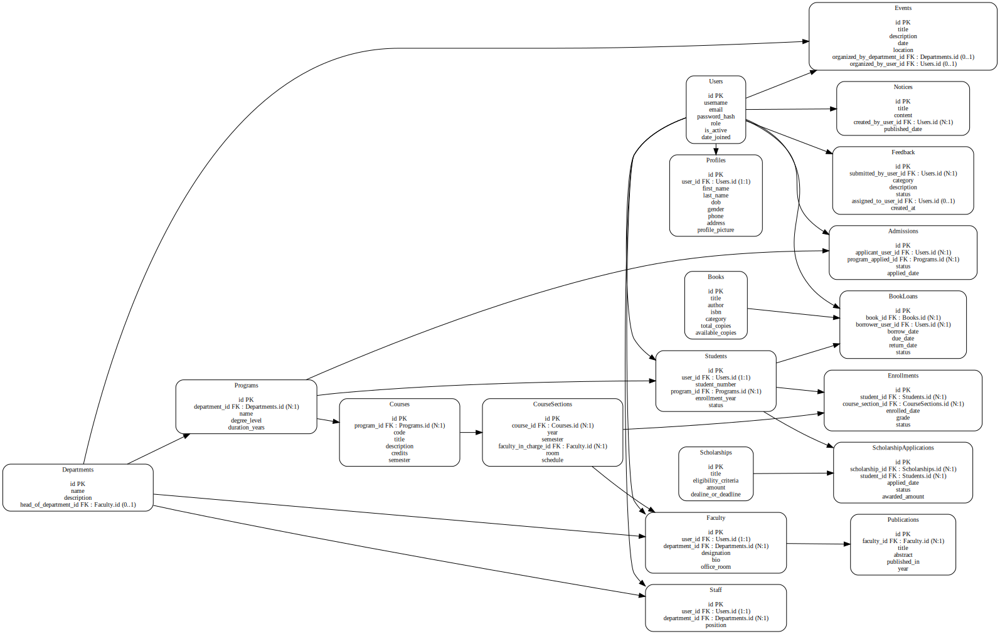
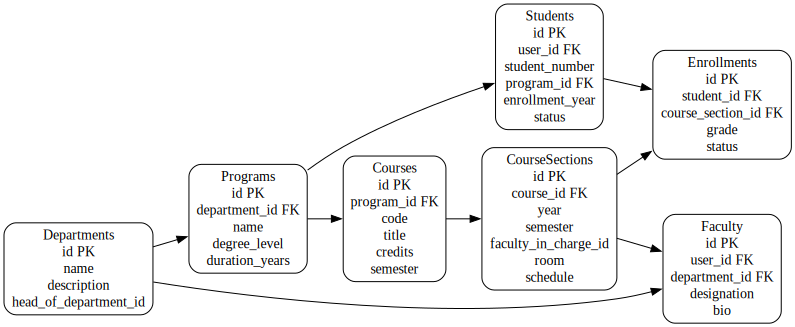

# 🎓 University-Level Institutional Website (Mega Project)

A comprehensive, scalable institutional website with full backend (Django + DRF), SQL database, frontend integration, and multiple modules for real-world use cases.

---

## 📑 Project Overview
- Backend: Django REST Framework (DRF)
- Database: PostgreSQL
- Frontend: React (or any modern SPA)
- Auth: JWT, Role-based Access Control (RBAC)
- Deployment: Docker, CI/CD, Cloud hosting

---

## 🗂️ ER Diagram (Full Project)

  <!-- 🔗 Line ~20 update with your actual path -->

---

## 🔍 ER Diagram by Module

### 1. Academics
  <!-- 🔗 Line ~28 -->

### 2. Library
.svg)  <!-- 🔗 Line ~33 -->

### 3. Admissions & Scholarships
.svg)  <!-- 🔗 Line ~38 -->

### 4. Research & Publications
.svg)  <!-- 🔗 Line ~43 -->

### 5. Events & Notices
.svg)  <!-- 🔗 Line ~48 -->

---

## 📊 Database Considerations
- **Foreign Keys:** Enforced with cascading deletes where logical (e.g., delete a course deletes course-specific enrollments, not students).  
- **Exceptions:** Scholarship rows are *never deleted*, only archived (`is_active=false`).  
- **Row Updates:**  
  - Student grades → updated per semester, history kept in `grade_audit` table.  
  - Library transactions → only `return_date` updated; issued record stays immutable.  
  - Research publications → updated by authors/admin, versioning table stores revisions.  

---

## ⚙️ Roles & Permissions
- **Admin:** Full access to all modules.  
- **Faculty:** Limited to their courses, research, advising.  
- **Student:** Limited to enrollment, library, scholarships.  
- **Staff:** Library management, events, finance.  

---

## 📌 Deployment Notes
- Use `.env` for DB credentials and JWT secret.  
- Run DB migrations after schema changes.  
- Ensure backup strategy for PostgreSQL.  

---

## 📄 License
MIT or institution-specific license.
